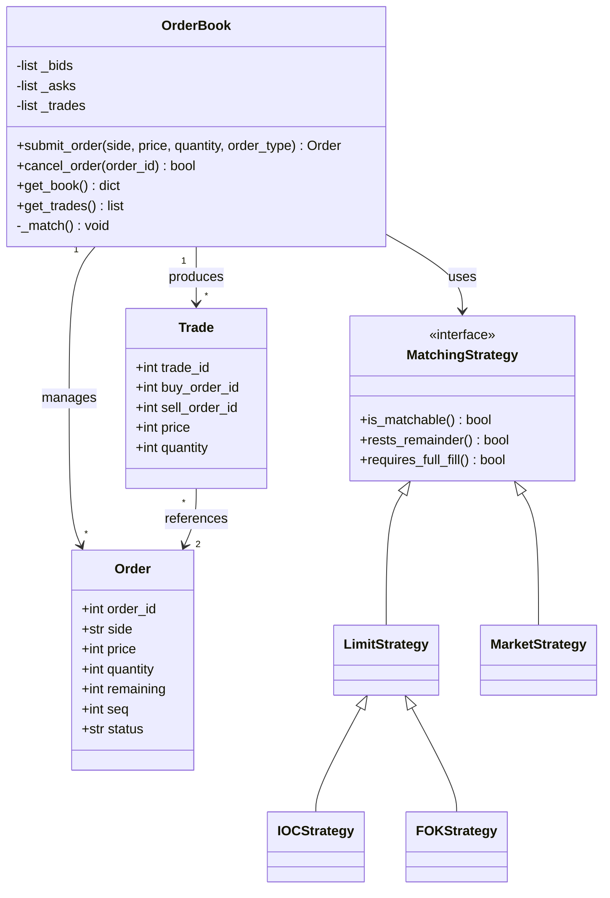
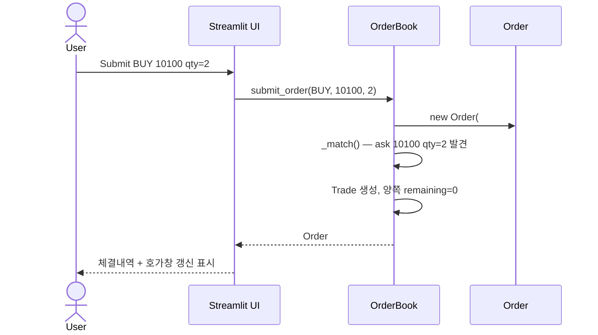
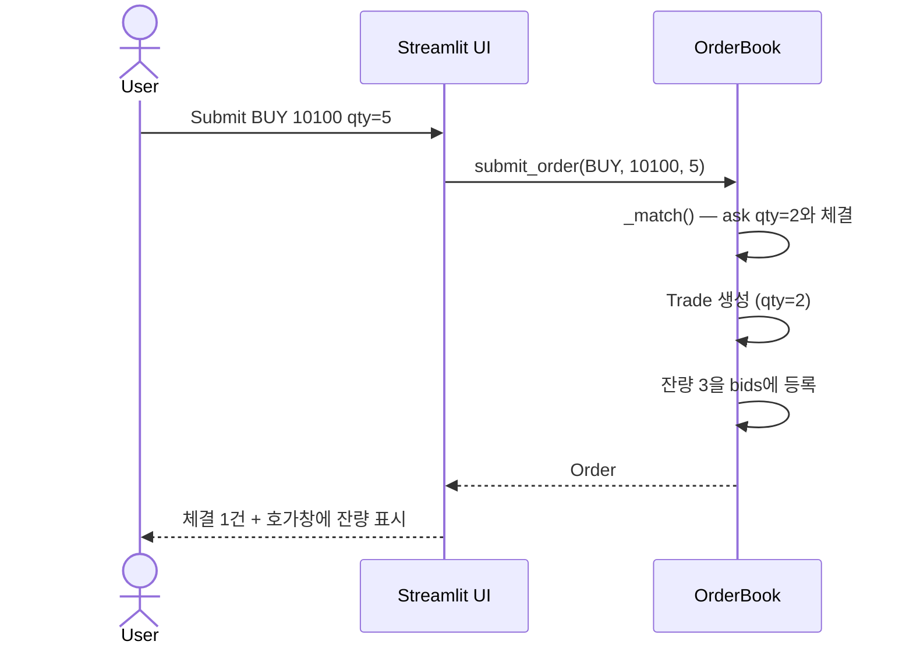

# Mini-OrderBook 상세 설계 (UI · 클래스 · 시퀀스)

**관련 문서**: [SRS.md](./SRS.md)

## 1. 사용자 분석

| 사용자 유형 | 스킬 수준 | 목표 | 핵심 니즈 |
|---|---|---|---|
| 학습형 (Primary) | 중급 (Python, REST API 경험) | 매칭 엔진·호가창 원리 학습 | 빠른 피드백, 결과 시각화 |
| 평가자 (Secondary) | 고급 | SW 공학 프로세스 적용 평가 |

학습형 사용자는 초보는 아니지만 거래소 도메인은 낯설 수 있어서, 멘탈 모델은 "엑셀 표에 주문 행이 쌓이고, 조건이 맞으면 두 행이 사라지면서 체결 기록이 생긴다" 정도의 단순한 비유로 잡았다.

---

## 2. 태스크 분석

핵심 태스크 흐름:

```
T1. 주문 제출 흐름
   사용자 → [Side/Price/Quantity 입력] → [Submit]
        → [매칭 결과 확인] → [호가창·체결내역 갱신 확인]

T2. 호가창 모니터링 흐름
   사용자 → [호가창 영역 시각 확인] → [매수/매도 깊이 비교]

T3. 주문 취소 흐름
   사용자 → [내 미체결 주문 식별] → [Order ID 입력]
        → [Cancel] → [호가창에서 제거 확인]
```

정보 흐름은 **(입력 폼) → (엔진 처리) → (호가창 + 체결내역 동시 갱신)**이다.

---

## 3. UI 설계 원리 적용

| 원리 | 본 시스템 적용 |
|---|---|
| 단순하고 자연스럽게 | 화면 한 페이지에 모든 기능 배치 (Streamlit single-page) |
| 안전한 사용·오류 회복 | 잘못된 입력(음수, 0) 시 즉시 에러 메시지, 주문은 처리 안 됨 |
| 직접 조작·즉시 피드백 | Submit 즉시 호가창·체결내역 갱신 |
| 일관성 유지 | 매수=초록, 매도=빨강 색상 코드 전 화면 통일 |
| 인식하기 쉽게 | 호가창에서 매수/매도를 좌우 분할로 배치 |
| 도움말은 최후 수단 | 라벨만으로 의미가 전달되도록 단어 선택 (Price, Quantity 등 표준 용어) |

---

## 4. UI 요소 매핑 

| 데이터 | UI 요소 |
|---|---|---|
| 매수/매도 구분 | **라디오 버튼** | 
| 주문 유형(지정가/시장가/IOC/FOK) | **선택 박스 (selectbox)** | 
| 가격(Price) | **텍스트 박스** (number input) |
| 수량(Quantity) | **텍스트 박스** (number input) | 
| 주문 제출 | **명령 버튼** ("Submit") | 
| 취소 대상 Order ID | **텍스트 박스** + 명령 버튼 | 
| 호가창·체결내역 출력 | **테이블** (Streamlit DataFrame) | 
| 에러 메시지 | **다이얼로그 박스** (Streamlit `st.error`) | 

---

## 5. 화면 설계 / 와이어프레임 [wireframe and diagram.md](./wireframe and diagram.md) 참조

Streamlit 단일 페이지. 좌(입력) → 우(결과) 흐름.

```
┌──────────────────────────────────────────────────────────────┐
│                    Mini-OrderBook Demo                       │
├──────────────────────────────────────────────────────────────┤
│                                                              │
│  ┌─ Order Submission ─────────┐  ┌─ Order Book ──────────┐   │
│  │  Side: ( ) Buy  ( ) Sell   │  │  SELL                 │   │
│  │  Price:  [        ]        │  │  Price  | Qty  | Time │   │
│  │  Qty  :  [        ]        │  │  10,200 | 5    | 09:01│   │
│  │  [   Submit Order   ]      │  │  10,100 | 3    | 09:00│   │
│  └────────────────────────────┘  │  ─────────────────────│   │
│                                  │  BUY                  │   │
│  ┌─ Cancel Order ─────────────┐  │  10,000 | 2    | 09:02│   │
│  │  Order ID: [      ]        │  │   9,900 | 7    | 08:59│   │
│  │  [    Cancel    ]          │  └────────────────────────┘  │
│  └────────────────────────────┘                              │
│                                  ┌─ Trade History ────────┐  │
│  ┌─ Status ───────────────────┐  │ Time  | Px    | Qty   │   │
│  │  ✓ Order #5 submitted      │  │ 09:00 | 10,100| 2     │   │
│  └────────────────────────────┘  │ 09:01 | 10,150| 1     │   │
│                                  └────────────────────────┘  │
└──────────────────────────────────────────────────────────────┘
```

화면 설계 원칙 
- 입력이 끝났음을 알리는 키 = **Submit 버튼**
- 입력 오류 감소를 위해 매수/매도는 **라디오 버튼**

---

## 6. 클래스 다이어그램 [wireframe and diagram.md](./wireframe and diagram.md) 참조



> 주문 유형(지정가·시장가·IOC·FOK)별 매칭 규칙은 각각의 전략 클래스가 맡고, `OrderBook`은 유형에 맞는 전략을 골라 위임만 한다. 전략 패턴을 쓴 이유는 architecture.md §6.2에 있다.

---

## 7. 시퀀스 다이어그램 [wireframe and diagram.md](./wireframe and diagram.md) 참조

### 7.1 완전 체결 시나리오



### 7.2 부분 체결 시나리오



---

## 8. 데이터 모델


- `OrderBook.bids`: `List[Order]`, 가격 내림차순 + 시간 오름차순
- `OrderBook.asks`: `List[Order]`, 가격 오름차순 + 시간 오름차순
- `OrderBook.trades`: `List[Trade]`, 시간 오름차순

나중에 확장하면 SQLite로 영속화할 수 있다 (SRS §1.2 Out-of-Scope).

---

## 9. 사용성 테스트 계획


| 항목 | 내용 |
|---|---|
| 테스트 목적 | 학습성(처음 사용자가 5분 내 첫 주문 제출 가능), 오류율(잘못 입력 시 명확한 피드백 비율) |
| 대표 사용자 | 페르소나 1 유형 1~2명 (시간 제약상 강의록 권장 5명 미달, §10에서 한계 명시) |
| 작업 시나리오 | (1) 매수 주문 제출 (2) 호가창 확인 (3) 부분 체결 유도 (4) 미체결 주문 취소 |
| 측정 항목 | 작업 완료 시간, 작업 성공률, 오류 발생 횟수 |
| 사전 설문 | "거래소 호가창을 본 적이 있는가" Y/N |
| 사후 설문 | 5점 척도: 학습 용이성, 만족도, 재사용 의향 |

---


## 10. 추후 확장 (Out-of-Scope)

다종목 거래, 사용자 인증, DB 영속성, 실시간 차트 — 모두 SRS §1.2 참고.

(시장가·IOC·FOK 주문은 처음엔 범위 밖이었지만 이후 요구로 추가돼 현재 구현돼 있다. 전략 패턴 적용 근거는 architecture.md §6.2 참조.)
