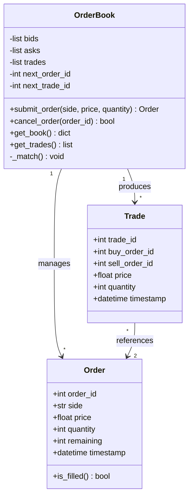
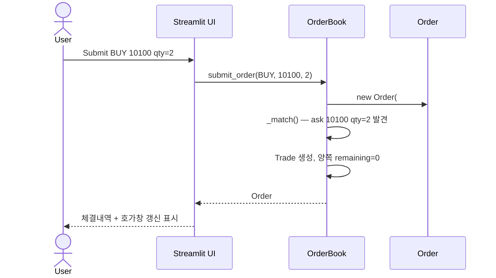
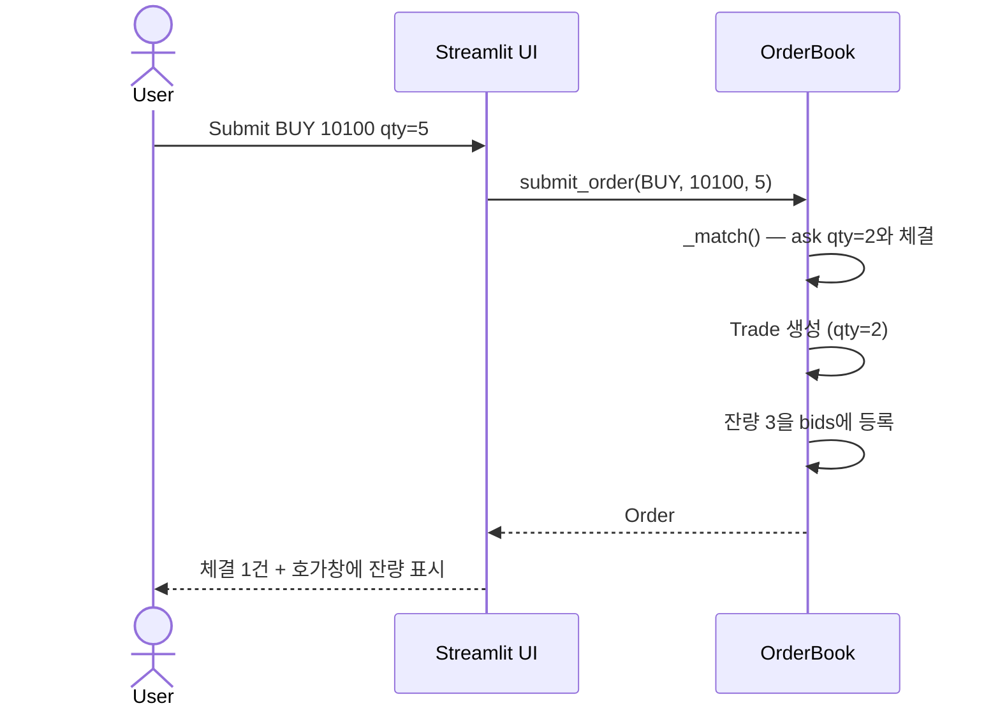

**관련 문서**: [SRS.md](./SRS.md)

## 1. 사용자 분석

| 사용자 유형 | 스킬 수준 | 목표 | 핵심 니즈 |
|---|---|---|---|
| 학습형 (Primary) | 중급 (Python, REST API 경험) | 매칭 엔진·호가창 원리 학습 | 빠른 피드백, 결과 시각화 |
| 평가자 (Secondary) | 고급 | SW 공학 프로세스 적용 평가 |

학습형 사용자는 **초보자가 아니지만 거래소 도메인은 친숙하지 않을 수 있으므로**, 멘탈 모델은 "엑셀의 표에 주문 행이 쌓이고, 조건이 맞으면 두 행이 사라지면서 체결 기록이 생긴다"는 수준의 단순한 비유로 잡는다.

---

## 2. 태스크 분석

핵심 태스크 흐름:

```
T1. 주문 제출 흐름
   사용자 → [Side/Price/Quantity 입력] → [Submit]
        → [매칭 결과 확인] → [호가창·체결내역 갱신 확인]

T2. 호가창 모니터링 흐름
   사용자 → [호가창 영역 시각 확인] → [매수/매도 깊이 비교]

T3. 주문 취소 흐름
   사용자 → [내 미체결 주문 식별] → [Order ID 입력]
        → [Cancel] → [호가창에서 제거 확인]
```

위 흐름에서 정보 흐름의 핵심 단위는 **(입력 폼) → (엔진 처리) → (호가창 + 체결내역 동시 갱신)**. 

---

## 3. UI 설계 원리 적용

| 원리 | 본 시스템 적용 |
|---|---|
| 단순하고 자연스럽게 | 화면 한 페이지에 모든 기능 배치 (Streamlit single-page) |
| 안전한 사용·오류 회복 | 잘못된 입력(음수, 0) 시 즉시 에러 메시지, 주문은 처리 안 됨 |
| 직접 조작·즉시 피드백 | Submit 즉시 호가창·체결내역 갱신 |
| 일관성 유지 | 매수=초록, 매도=빨강 색상 코드 전 화면 통일 |
| 인식하기 쉽게 | 호가창에서 매수/매도를 좌우 분할로 배치 |
| 도움말은 최후 수단 | 라벨만으로 의미가 전달되도록 단어 선택 (Price, Quantity 등 표준 용어) |

---

## 4. UI 요소 매핑 

| 데이터 | UI 요소 |
|---|---|---|
| 매수/매도 구분 | **라디오 버튼** | 
| 가격(Price) | **텍스트 박스** (number input) |
| 수량(Quantity) | **텍스트 박스** (number input) | 
| 주문 제출 | **명령 버튼** ("Submit") | 
| 취소 대상 Order ID | **텍스트 박스** + 명령 버튼 | 
| 호가창·체결내역 출력 | **테이블** (Streamlit DataFrame) | 
| 에러 메시지 | **다이얼로그 박스** (Streamlit `st.error`) | 

---

## 5. 화면 설계 / 와이어프레임 

Streamlit 단일 페이지. 좌(입력) → 우(결과) 흐름.

```
┌──────────────────────────────────────────────────────────────┐
│                    Mini-OrderBook Demo                       │
├──────────────────────────────────────────────────────────────┤
│                                                              │
│  ┌─ Order Submission ─────────┐  ┌─ Order Book ──────────┐   │
│  │  Side: ( ) Buy  ( ) Sell   │  │  SELL                 │   │
│  │  Price:  [        ]        │  │  Price  | Qty  | Time │   │
│  │  Qty  :  [        ]        │  │  10,200 | 5    | 09:01│   │
│  │  [   Submit Order   ]      │  │  10,100 | 3    | 09:00│   │
│  └────────────────────────────┘  │  ─────────────────────│   │
│                                  │  BUY                  │   │
│  ┌─ Cancel Order ─────────────┐  │  10,000 | 2    | 09:02│   │
│  │  Order ID: [      ]        │  │   9,900 | 7    | 08:59│   │
│  │  [    Cancel    ]          │  └────────────────────────┘  │
│  └────────────────────────────┘                              │
│                                  ┌─ Trade History ────────┐  │
│  ┌─ Status ───────────────────┐  │ Time  | Px    | Qty   │   │
│  │  ✓ Order #5 submitted      │  │ 09:00 | 10,100| 2     │   │
│  └────────────────────────────┘  │ 09:01 | 10,150| 1     │   │
│                                  └────────────────────────┘  │
└──────────────────────────────────────────────────────────────┘
```

화면 설계 원칙 
- 입력이 끝났음을 알리는 키 = **Submit 버튼**
- 입력 오류 감소를 위해 매수/매도는 **라디오 버튼**

---

## 6. 클래스 다이어그램 



---

## 7. 시퀀스 다이어그램 

### 7.1 완전 체결 시나리오



### 7.2 부분 체결 시나리오



---

## 8. 데이터 모델


- `OrderBook.bids`: `List[Order]`, 가격 내림차순 + 시간 오름차순
- `OrderBook.asks`: `List[Order]`, 가격 오름차순 + 시간 오름차순
- `OrderBook.trades`: `List[Trade]`, 시간 오름차순

향후 확장 시 SQLite로 영속화 가능 (SRS §1.2 Out-of-Scope).

---

## 9. 사용성 테스트 계획


| 항목 | 내용 |
|---|---|
| 테스트 목적 | 학습성(처음 사용자가 5분 내 첫 주문 제출 가능), 오류율(잘못 입력 시 명확한 피드백 비율) |
| 대표 사용자 | 페르소나 1 유형 1~2명 (시간 제약상 강의록 권장 5명 미달, §10에서 한계 명시) |
| 작업 시나리오 | (1) 매수 주문 제출 (2) 호가창 확인 (3) 부분 체결 유도 (4) 미체결 주문 취소 |
| 측정 항목 | 작업 완료 시간, 작업 성공률, 오류 발생 횟수 |
| 사전 설문 | "거래소 호가창을 본 적이 있는가" Y/N |
| 사후 설문 | 5점 척도: 학습 용이성, 만족도, 재사용 의향 |

---

## 10. Lessons Learned — 설계 단계

설계 과정에서 얻은 교훈을 기록한다. 본 문서의 §1~§9를 작성하면서 실제로 부딪힌 트레이드오프 중심으로 기술.

**LL-D1**. AI는 "바로 코드"를 원하지만, 설계 산출물을 먼저 만들게 시키면 코드 일관성이 올라간다
초기에 AI에게 "Streamlit으로 호가창 데모 만들어줘"라고만 시키니 매번 다른 구조의 코드를 생성했다. SRS와 클래스 다이어그램을 먼저 첨부한 뒤 "이 설계를 따라 구현해줘"라고 지시하니, 함수 시그니처와 클래스 구조가 강의록의 설계 베이스라인과 일치하는 코드가 나왔다.
→ 교훈: 바이브코딩의 "감"을 신뢰하면 매번 결과가 다르다. 프로세스 산출물(SRS, 클래스 다이어그램)을 프롬프트의 앵커로 쓰면 AI 출력이 재현 가능해진다.
**LL-D2**. UI 설계 원리 10가지는 AI 산출물의 사후 검증 체크리스트로 강력하다
AI는 동작하는 화면은 잘 만들지만 "에러 메시지를 어디에 띄울지", "매수/매도 색상을 일관되게 쓸지" 같은 결정은 빠뜨린다. 10대 원리를 체크리스트로 변환해 AI 출력에 적용하니 5분 만에 결함 3건을 발견했다.
→ 교훈: AI는 "동작하는 것"에 강하고 "원칙에 부합하는지"는 약하다. 설계 원리를 검증 게이트로 명시적으로 끼워 넣어야 한다.
**LL-D3**. 시퀀스 다이어그램은 AI에게 시키기 전에 사람이 그려야 한다
AI에게 "부분 체결 시퀀스 다이어그램 그려줘"라고 시켰을 때, 잔량 처리 순서를 그럴듯하지만 잘못된 흐름으로 채워 넣었다(잔량을 매칭 전에 등록하는 식). 사람이 먼저 흐름을 정의하고 AI에게는 Mermaid 문법 변환만 시키니 정확해졌다.
→ 교훈: 도메인 모호성이 있는 산출물은 AI의 강점(생성)이 아니라 약점(환각)이 부각된다. 시퀀스 다이어그램 같은 "비자명 시나리오 명세화" 작업은 사람이 주도하고 AI는 형식 변환 보조로 쓰는 게 맞다.
**LL-D4**. ASCII 와이어프레임은 Figma보다 바이브코딩 친화적이다
처음에는 Figma로 와이어프레임을 그려야 하나 고민했으나, AI에게 줄 입력으로는 ASCII 박스 다이어그램(본 문서 §5)이 훨씬 효율적이었다. AI가 이미지 해석에 토큰을 쓰지 않고 텍스트 그대로 코드에 매핑한다.
→ 교훈: 바이브코딩 환경에서는 "AI가 잘 읽는 산출물 형식"으로 프로세스 산출물을 변환할 가치가 있다. 격식 있는 도구(Figma 등)가 항상 정답은 아니다.


---

## 11. 추후 확장 (Out-of-Scope)

시장가 주문, 다종목, 사용자 인증, DB 영속성, 실시간 차트 — 모두 SRS §1.2 참고.
