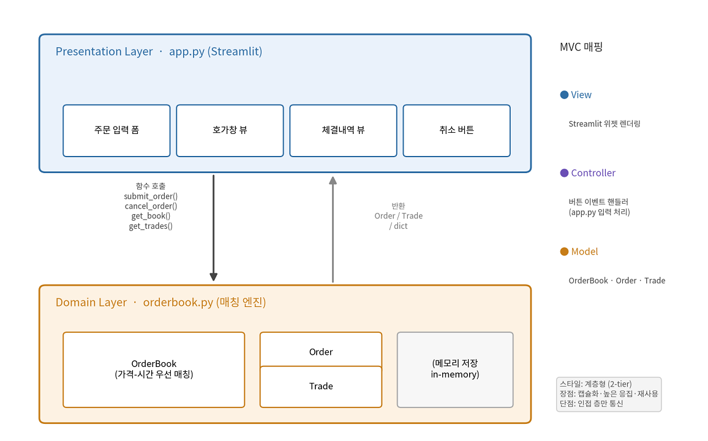

# Mini-OrderBook 아키텍처 설계

**관련 문서**: [Design.md](./Design.md), [requirements_model.md](./requirements_model.md)

---

## 0. 본 문서 범위

설계 단계 산출물 중 아키텍처 쪽을 정리한다. Design.md가 UI 설계랑 클래스/시퀀스 다이어그램에 집중했다면, 이 문서는 그 위 단계인 아키텍처 스타일을 왜 그렇게 골랐는지, 설계 원리를 어떻게 적용했는지를 다룬다.

## 1. 아키텍처 기초 

시스템을 서브시스템(모듈) 두 개로 나눴다.

- **Presentation 서브시스템** (`app.py`): 사용자 입력을 받고 결과를 보여준다. Streamlit 위젯으로 구성.
- **Domain 서브시스템** (`orderbook.py`): 주문 매칭이라는 핵심 로직. `OrderBook`, `Order`, `Trade`, 그리고 주문 유형별 매칭 전략으로 구성.

이 둘은 함수 호출 인터페이스(`submit_order`/`cancel_order`/`get_book`/`get_trades`)로만 주고받는다.

---

## 2. 아키텍처 스타일 선정 

### 2.1 후보 비교

강의록에 나온 스타일 중 이 시스템에 쓸 만한 후보들을 비교했다.

| 스타일 | 적합성 | 판단 |
|---|---|---|
| **계층형 (Layered)** | 매우 적합 | UI와 도메인 로직을 위아래로 깔끔하게 나누는 데 맞음 → **채택** |
| MVC | 적합 | 계층형 위에 역할 매핑으로 보조 적용 (View/Controller/Model) |
| 이벤트 기반 | 보통 | 단일 사용자·동기 처리라 이벤트 버스까지 두면 과설계 |
| 파이프-필터 | 부적합 | 데이터 변환 파이프라인이 아니라 안 맞음 |
| 클라이언트-서버 | 부적합 | 네트워크로 분산되지 않는 단일 프로세스라 불필요 |

### 2.2 계층형 채택 근거

계층형의 장점이 이 시스템 목표랑 잘 맞는다.

- **추상화·캡슐화**: UI는 매칭 알고리즘 내부를 몰라도 된다.
- **높은 응집**: 매칭 로직이 Domain 층 한 곳에 모인다.
- **재사용**: 같은 엔진을 CLI·테스트·다른 UI에서 그대로 쓸 수 있다(실제로 `test_orderbook.py`가 UI 없이 엔진만 가져다 검증한다).

### 2.3 MVC 관점 매핑

계층형 위에 MVC 역할을 얹어 보면 책임이 더 분명해진다.

| MVC 역할 | 본 시스템 대응 |
|---|---|
| **Model** | `OrderBook`, `Order`, `Trade`, 매칭 전략들 — 상태와 매칭 규칙 |
| **View** | Streamlit 위젯 렌더링 (호가창 테이블, 체결내역) |
| **Controller** | `app.py`의 버튼 이벤트 핸들러 — 입력을 받아 Model 메서드 호출 |

### 2.4 아키텍처 다이어그램

---

## 3. 전통적 설계 원리 적용

| 원리 | 적용 내용 |
|---|---|
| **추상화** | `OrderBook`이 가격-시간 우선 매칭의 복잡함을 public 메서드 4개 뒤로 숨긴다 |
| **캡슐화 / 정보 은닉** | `_bids`/`_asks`/`_trades`는 비공개고, 외부는 `get_book()`/`get_trades()`로만 접근한다. 이 둘은 **방어적 복사**(`list(...)`)를 돌려줘서 내부 상태가 밖에서 바뀌는 걸 막는다 |
| **모듈화** | 도메인(`orderbook.py`)과 표현(`app.py`)을 별도 모듈로 분리 |

---

## 4. 객체지향 설계 원리 적용

| 원리 | 적용 내용 |
|---|---|
| **SRP (단일 책임)** | `Order`/`Trade`는 데이터만, `OrderBook`은 매칭만, `app.py`는 표현만 맡는다. 엔진 내부도 `_match`/`_record_trade`/`_insert_into_book`/`_validate_order_input`로 책임을 쪼갰고, 주문 유형별 규칙은 각 전략 클래스가 따로 맡는다 |
| **OCP (개방-폐쇄)** | 지정가 한 종류로 시작했지만, §6의 전략 패턴 덕에 시장가·IOC·FOK를 **`OrderBook` 본체는 거의 안 건드리고** 전략 클래스만 추가해 확장했다 |
| **DIP (의존 관계 역전)** | `app.py`(구체적 UI)가 `OrderBook`의 **안정적인 public 인터페이스**에 의존하고, 내부 구현에는 의존하지 않는다. |

---

## 5. 설계 메트릭 관점 

숫자로 재는 건 품질 문서에서 하고, 여기서는 아키텍처 수준의 정성 평가만 적는다.

- **결합도 (Coupling)**: 낮다. 모듈 간 의존이 한 방향(Presentation → Domain)이고 함수 시그니처로만 연결된다.
- **응집도 (Cohesion)**: 높다. `OrderBook`의 모든 메서드가 "주문 매칭"이라는 한 가지 목적에 쓰인다(기능적 응집).
- **복잡도**: 낮다. 분기가 얕고(`_match` 루프 1중첩), 매직 넘버가 없다.

---

## 6. 디자인 패턴 

### 6.1 데이터 클래스

`Order`·`Trade`는 필드만 들고 로직은 넣지 않는 단순 데이터 클래스로 뒀다. 데이터와 매칭 로직을 분리해 두면 책임이 섞이지 않는다.

### 6.2 전략 패턴 (Strategy) — 실제 적용 

처음엔 지정가 주문 하나뿐이라 무거운 패턴은 YAGNI로 미루고 "확장 지점만 표시해 둔다"고 적었다. 그런데 이후 **시장가·IOC·FOK 주문 요구가 들어오면서 바로 이 지점에 전략 패턴을 실제로 적용**했다.

- `MatchingStrategy`(인터페이스)가 `is_matchable` / `rests_remainder` / `requires_full_fill` 세 가지를 정의하고,
- `LimitStrategy`(지정가) · `MarketStrategy`(시장가) · `IOCStrategy` · `FOKStrategy`가 각각 자기 규칙만 구현한다. IOC·FOK는 지정가와 가격 교차 조건이 같아 `LimitStrategy`를 상속하고 다른 부분(잔량 처리/전량 조건)만 override했다.
- `OrderBook`은 주문 유형에 맞는 전략을 골라 위임만 한다.

덕분에 주문 유형을 세 번 늘리는 동안 `OrderBook` 본체는 거의 안 바뀌었다(OCP). 

---

