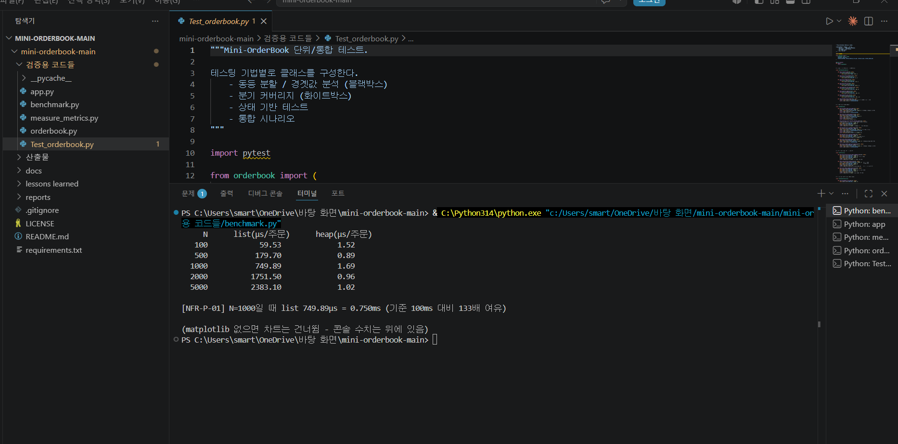

# 성능 벤치마크 — list vs heap

**관련 문서**: [architecture.md](./architecture.md), [SRS.md](./SRS.md) (NFR-P-01·P-02), [quality.md](./quality.md)

---

## 0. 측정 배경

아키텍처를 정할 때 호가창 자료구조로 list를 골랐고, ATAM 평가에는 "구현이 단순하고 이 정도 규모면 성능은 충분하다"고 적었다. 직접 측정해보고자 같은 시나리오를 지금 구현(list)과 대안(heap)으로 각각 돌려서, 호가가 많아질수록 주문당 처리 시간이 어떻게 달라지는지 비교했다.

## 1. 측정 방법

호가창에 미체결 주문을 N개 쌓아 둔 상태에서, 주문 한 건을 처리하는 데 걸리는 평균 시간(µs)을 쟀다.
- N은 100, 500, 1,000, 2,000, 5,000으로 잡았다. SRS의 NFR-P-02가 "1,000건 이상"이라 그 값을 포함하고 더 큰 경우까지 봤다.
- 시간은 `time.perf_counter`로 재고, 한 번만 재면 값이 튈 수 있어 각 N마다 5번 측정한 뒤 중앙값을 썼다.
- 비교 대상은 현재 list 기반 `OrderBook`과, 같은 동작을 하는 heap 기반 최소 구현이다.

## 2. 측정 결과

| 호가 수 N | list (µs/주문) | heap (µs/주문) |
|---:|---:|---:|
| 100 | 49.31 | 2.97 |
| 500 | 159.85 | 0.50 |
| 1,000 | 267.54 | 0.41 |
| 2,000 | 447.29 | 0.58 |
| 5,000 | 1083.25 | 0.45 |

## 3. NFR 충족 확인

| NFR | 기준 | 측정 결과 |
|---|---|---|---|
| NFR-P-01 | 단일 주문 처리 ≤ 100ms (=100,000µs) | N=1,000에서 267.54µs ≈ 0.268ms |
| NFR-P-02 | 미체결 주문 1,000건 이상 보관 | N=5,000까지 정상 처리 |

둘다 충족했다.

