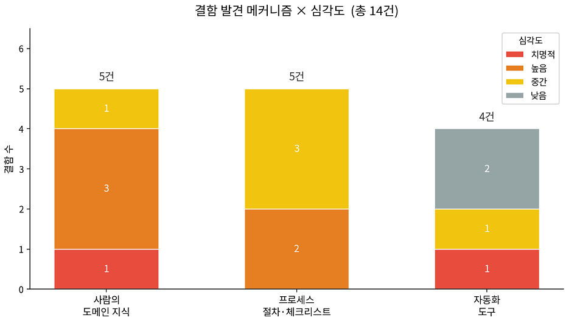

# Mini-OrderBook 결함 로그 (AI 산출물 결함 추적)

**버전**: 0.1
**관련 문서**: [coding.md](./coding.md), [maintenance.md](./maintenance.md), 작업별 교훈(`lessons learned/`)

---

## 0. 본 문서의 목적

바이브코딩으로 개발하는 동안 AI가 만든 결함을 전부 모으고, 각 결함을 어느 단계에서 어떤 방어선이 잡았는지 추적한다. 결함에는 코드 버그뿐 아니라 요구·설계 단계의 누락이나 오류도 포함했다.

---

## 1. 분류 기준

### 심각도

| 등급 | 의미 |
|---|---|
| **치명적** | 그대로 두면 체결 결과가 직접 틀어지는 결함 |
| **높음** | 설계·성능·과제 목적에 큰 영향을 주는 결함 |
| **중간** | 품질·검증 충실도를 떨어뜨리는 결함 |
| **낮음** | 스타일·정리 수준의 결함 |

### 발견 메커니즘 

| 메커니즘 | 설명 |
|---|---|
| **사람의 도메인 지식** | AI가 도메인을 몰라 낸 결함을 사람이 잡음 |
| **프로세스 절차·체크리스트** | 강의록 기준·산출물 대조로 잡음 |
| **자동화 도구** | 단위 테스트·커버리지·정적 분석이 숫자로 잡음 |

---

## 2. 결함 로그

| ID | 단계 | AI가 만든 결함 | 심각도 | 발견 메커니즘 | 조치 |
|---|---|---|---|---|---|
| D-01 | 요구 분석 | 체결가를 어느 주문 가격으로 정할지(먼저 호가창에 있던 주문 기준) 규칙 누락 | 치명적 | 사람 도메인 지식 | 도메인 규칙을 사람이 명세해 SRS에 반영 |
| D-02 | 요구 분석 | 부분 체결 불변식(체결량 + 잔량 = 원주문량) 누락 | 높음 | 사람 도메인 지식 | 불변식을 요구사항·테스트로 명시 |
| D-03 | 요구 분석 | 다단계 매칭(한 주문이 여러 호가 체결) 시나리오 누락 | 높음 | 사람 도메인 지식 | 시나리오 추가, 통합 테스트로 검증 |
| D-04 | 설계 | 호가창 저장 구조로 Heap 추천 — 잦은 취소에 비효율(임의 삭제 O(n)) | 높음 | 사람 도메인 지식 | 취소 맥락 고려해 list 채택(ATAM 근거) |
| D-05 | 요구 분석 | Order에 userId 추가 — 단일 사용자 스코프 위반 | 중간 | 사람 도메인 지식 | 필드 제거, 스코프 재확인 |
| D-06 | 요구 분석 | 테스트가능성·추적성·페르소나 누락(과제 목적 미반영) | 높음 | 프로세스 절차 | NFR·추적성·페르소나를 SRS에 추가 |
| D-07 | 설계 | 부분 체결 시퀀스에서 잔량을 매칭 전에 등록(잘못된 흐름) | 높음 | 프로세스 절차 | 흐름은 사람이 정의, AI는 Mermaid 변환만 |
| D-08 | 구현 | 매칭 로직이 한 함수에 길게 뭉침(책임 미분리) | 중간 | 프로세스 절차 | 헬퍼 메서드로 분리(단일 책임) |
| D-09 | 구현 | 자바식 명명을 그대로 쓰면 PEP 8 위반 소지 | 낮음 | 자동화 도구 | snake_case로 변환 |
| D-10 | 구현 | 리팩토링 중 잔량 갱신 순서가 바뀌어 부분 체결 결과 1 오차 | 치명적 | 자동화 도구 | 단위 테스트로 발견 즉시 수정 |
| D-11 | 구현 | 미사용 메서드(예: get_best_bid) 데드코드 잔존 | 낮음 | 자동화 도구 | 제거 |
| D-12 | 테스트 | 성공 경로(happy path) 위주로만 테스트 생성 | 중간 | 프로세스 절차 | 동등 분할·경곗값 케이스 추가 |
| D-13 | 테스트 | 상태 기반 테스트 누락 | 중간 | 프로세스 절차 | 주문 상태 전이 테스트 추가 |
| D-14 | 테스트 | 테스트는 통과하나 매수 호가 삽입 정렬 루프 미커버(99%) | 중간 | 자동화 도구 | 케이스 추가해 100% 달성 |

---

## 3. 통계

**단계별 결함 수**

| 단계 | 건수 |
|---|---|
| 요구 분석 | 5 |
| 설계 | 2 |
| 구현 | 4 |
| 테스트 | 3 |
| **합계** | **14** |

**발견 메커니즘별 분포**

| 메커니즘 | 건수 |
|---|---|
| 사람의 도메인 지식 | 5 | 
| 프로세스 절차·체크리스트 | 5 |
| 자동화 도구 | 4 | 

**심각도별 분포**: (치명적 2 · 높음 5 · 중간 5 · 낮음 2)

---

