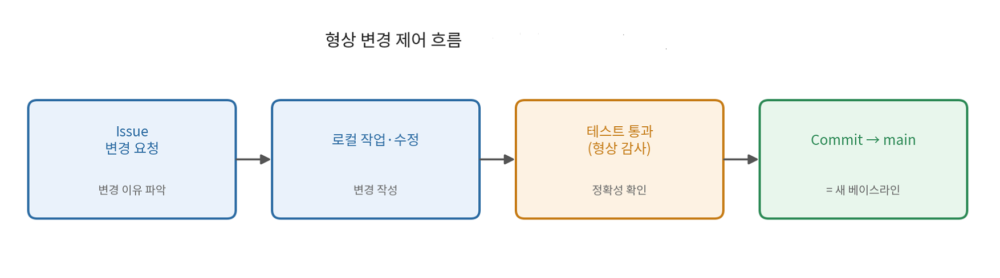

# Mini-OrderBook 형상관리 및 유지보수

**관련 문서**: [process.md](./process.md), [Design.md](./Design.md), [architecture.md](./architecture.md), [requirements_model.md](./requirements_model.md)
**대상 형상관리 시스템**: GitHub — `smartjun14-af/mini-orderbook` (Public)

---

## 0. 본 문서 범위

프로젝트가 GitHub에서 실제로 한 활동(커밋·이슈·Discussions)에 매핑해서 적는다.

> repo 현황(작성 시점): **123 commits · 10 issues · Discussions 8 · tag 1 · Projects 활성 · MIT License**
> 이 프로젝트는 **브랜치를 나누지 않고 단일 main 브랜치에 바로 커밋**하는 방식으로 진행했다(§3·§7 참조).

---

## 1. 형상 식별 (Configuration Identification)

### 1.1 형상 항목 (Configuration Items) — 실제 repo 구조

| 분류 | 형상 항목 | 위치 |
|---|---|---|
| 소스·측정 코드 | `orderbook.py`(매칭 엔진), `app.py`(UI), `benchmark.py`, `measure_metrics.py`, `test_orderbook.py` | `검증용 코드들/` |
| 프로세스 문서 | `SRS.md`, `requirements_model.md`, `Design.md`, `architecture.md`, `process.md`, `coding.md`, `static Analysis.md`, `quality.md`, `Traceability.md`, `defect_log.md`, `benchmark.md`, `maintenance.md` | `docs/` |
| 설계 메모 | `market_order_design` (시장가 설계 메모) | 루트 |
| 다이어그램·자료 | `usecase_diagram.PNG`, `아키텍쳐.PNG`, `changecontrol_diagram.PNG`, `defect_chart.PNG`, `quality_complexity.PNG`, `wireframe and diagram.zip` | `reports/` |
| AI 비교 자료 | `gpt-generated-SRS.md`, `gptSRS.PNG` | `reports/` |
| 스크린샷 | 주문 체결·품질 메트릭 등 실행 캡처 | `산출물/` |
| 작업별 교훈 | SRS · 요구 모델링 · 설계 · 아키텍처 · 매칭 엔진 구현 · 단위 테스트 · 정적 분석 · 추적성 · 성능 벤치마크 · 품질 관리 · 프로세스 모델 정의 · 형상관리 (12개) | `lessons learned/` |
| 설정·기타 | `README.md`, `LICENSE`(MIT), `.gitignore`, `requirements.txt` | 루트 |

### 1.2 베이스라인 (Baseline)

강의록은 베이스라인을 "형상 항목의 집합으로, 프로젝트의 중요한 상태를 정의하고 이후 변경 제어의 기준이 되는 것"으로 정의한다. 이 프로젝트의 베이스라인은 다음과 같다.

| 베이스라인 | 정의 시점 | 내용 |
|---|---|---|
| 요구 베이스라인 | SRS 확정 | 페르소나·US·FR·NFR 고정 |
| 코드 베이스라인 | 단위 테스트 100% 통과 시점 | 매칭 엔진 + 테스트가 함께 검증된 상태 |

> 현재 tag 2개를 찍어 베이스라인 한 시점을 표시해 뒀다.

---

## 3. 형상 변경 제어 (Change Control)

이 프로젝트는 브랜치/PR 없이 단일 main에 바로 커밋했다. 

| 절차 | 본 프로젝트 대응 | 사례 |
|---|---|---|
| 변경 이유 파악 | **Issue** 생성 | US를 Issue로 등록(현재 10 issues, US-01~10 — 시장가·IOC·FOK 요구가 늘며 US-08·09·10 추가), 결함·개선 요청 등록 |
| 변경 작성 | **로컬 작업·수정** | 코드/문서를 로컬에서 수정 |
| 변경 평가(정확성) | **단위 테스트 통과** | 테스트 100% 통과로 변경의 정확성 확인 (= 형상 감사 게이트, §5) |
| 변경 추가·반영 | **Commit → main** | main에 바로 커밋, 변경 이유를 메시지로 기록 |

---

## 4. 형상 상태 보고 (Status Accounting)

| 보고 수단 | 추적 내용 |
|---|---|
| **커밋 히스토리 (123건)** | 모든 변경의 시간순 이력 — 무엇이 언제 바뀌었는지 |
| **Issues 상태 (open/closed, 10건)** | 작업 단위별 진행 상태 |
| **Projects 보드** | 작업 상태를 칸반 형태로 시각화 |
| **Discussion (8건)** | 날짜별(day0~day9) 한 일·토의·다음 할 일 |
| **README.md** | 프로젝트 현재 상태와 실행 방법 |

---

## 5. 형상 감사 (Configuration Audit)

형상 감사는 "형상 항목 검토(업데이트돼도 차이가 없음을 보장)"와 "형상 항목 확인(올바른 문제를 풀었는지 정확성 체크)"으로 나뉜다.

| 감사 활동 | 본 프로젝트 적용 |
|---|---|
| 형상 항목 **검토** | 코드(클래스·함수)가 설계 베이스라인(Design 클래스 다이어그램)과 맞는지 대조 |
| 형상 항목 **확인** | **단위 테스트 100% 통과**  |
| 일관성 감사 | 유스케이스 명세 ↔ 시퀀스 다이어그램 일치 점검(requirements_model §5) |

---

## 6. 유지보수 유형 적용

| 유형 | 정의 | 본 프로젝트 사례 |
|---|---|---|
| **수정형 (corrective)** | 발견된 결함 수정 | 리팩토링 중 생긴 부분 체결 1 오차를 단위 테스트로 발견해 수정 |
| **완전형 (perfective)** | 성능·유지보수성 개선 | `submit_order` 매칭 로직을 헬퍼/전략으로 분리하는 리팩토링, 파일명 정리 |
| **적응형 (adaptive)** | 환경 변화 적응 | 강의록의 Java 명명 규칙을 Python(PEP 8) 환경에 맞게 변환 |
| **예방형 (preventive)** | 오류 예방 | 100% 커버리지·정적 분석으로 앞으로의 결함을 미리 차단 |

---

