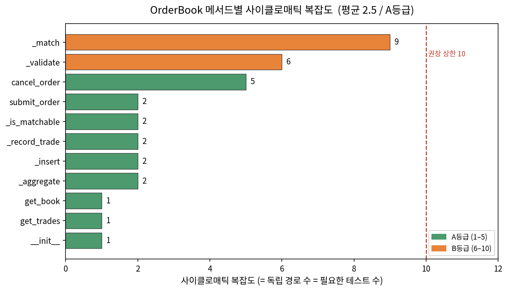

# 품질 관리 문서 (Quality Management)

**관련 문서**: [process.md](./process.md), [SRS.md](./SRS.md), [Design.md](./Design.md), [architecture.md](./architecture.md), [CODING.md](./CODING.md), [TESTING.md](./TESTING.md), [maintenance.md](./maintenance.md), [defect_log.md](./defect_log.md)

---

## 0. 본 문서의 범위

본 문서는 V-모델의 마지막 단계인 **품질 관리**에 해당한다. 앞 단계에서 만든 산출물(요구·설계·코드·테스트)을 **품질 속성**과 **품질 메트릭**으로 평가한다.
여기서 사용하는 모든 메트릭은 추정값이 아니라, 최종 코드(`orderbook.py`)에 대해 `radon`과 `pytest --cov`로 **직접 측정한 값**이다.

---

## 1. 품질 모델 선정

소프트웨어공학 강의록 Ch.12를 보면 품질 모델로 **ISO/IEC 9126**(품질 특성 6가지)과 IEEE 1061을 제시한다. 본 프로젝트는 ISO/IEC 9126의 6대 품질 특성을 평가 기준으로 채택한다.

| 채택 | 근거 |
|---|---|
| ISO/IEC 9126 | 강의록이 기준 모델로 다루며, 6개 특성(기능성·신뢰성·사용용이성·효율성·유지보수성·이식성)이 소규모 학습 시스템에도 빠짐없이 대응되어 누락 없는 점검표가 된다. |

---

## 2. 품질 속성 평가 (정성 평가)

ISO/IEC 9126의 6대 특성을 기준으로, 각 특성을 어떤 산출물·결정으로 만족시켰는지 정리한다.

| 품질 특성 | 본 시스템에서의 실현 | 근거 산출물 |
|---|---|---|
| **기능성** (정확성) | 체결가가 "호가창에 먼저 있던 주문(수동 주문)의 가격"을 따르도록 정확히 구현. 초기 AI 코드는 이 규칙이 틀렸으나(결함 D-01) 사람이 도메인 검토로 교정. | defect_log D-01, `_record_trade` |
| **신뢰성** (결함 없음·오류 허용성) | 모든 입력을 `_validate_order_input`으로 검증해 잘못된 주문을 거부. 단위 테스트 32개·커버리지 100%로 동작 보장. 개발 중 결함 14건을 제거. | `test_orderbook.py`, defect_log |
| **사용용이성** (학습성) | Streamlit UI에 주문 폼·호가창·체결내역을 한 화면에 배치하고 색상·피드백을 일관되게 설계. | Design.md, `app.py`, 스크린샷 |
| **효율성** (시간·자원) | 메모리 기반 list 구조로 단순하나, 대량 주문엔 불리. 아키텍처 단계에서 list↔heap 트레이드오프를 명시적으로 검토하고 벤치마크로 검증. | architecture.md (ATAM), benchmark.md |
| **유지보수성** (분석·변경·시험용이성) | 책임을 메서드 단위로 분리(`_match`·`_record_trade` 등)하고, 유지보수성 지수(MI) A등급, 커버리지 100%로 변경 시 회귀를 즉시 탐지. | CODING.md, §3 메트릭 |
| **이식성** (설치용이성·재사용성) | 엔진(`orderbook.py`)은 외부 라이브러리 의존이 없는 순수 Python이라 어디서나 실행 가능. UI(Streamlit)와 엔진이 분리되어 엔진만 재사용 가능. | architecture.md (계층 분리) |

---

## 3. 품질 메트릭 측정

강의록 Ch.12의 **전통적 품질 메트릭**(구현 메트릭·시스템 메트릭)과 Ch.6의 **설계 메트릭**(복잡도·결합도·응집도)을 측정했다.

### 3.1 구현 메트릭

| 메트릭 | 측정값 | 도구 |
|---|---|---|
| LOC (전체 줄 수) | 215 | radon raw |
| SLOC (순수 코드 줄) | 119 | radon raw |
| 주석+docstring 비율 | 약 27% | radon raw |
| **사이클로매틱 복잡도(평균)** | **2.5 (A등급)** | radon cc |
| 최대 복잡도 메서드 | `_match` = 9 (B), `_validate_order_input` = 6 (B), `cancel_order` = 5 (A) | radon cc |

사이클로매틱 복잡도를 **"프로그램을 통과하는 독립 경로의 개수이며, 필요한 테스트의 횟수"**로 정의한다. 이 정의에 따르면 `_match`(복잡도 9)는 독립 경로가 9개이므로 최소 9개의 테스트가 필요하다. 실제로 체결 로직(`_match`)을 거치는 테스트는 체결·우선순위·상태·통합 클래스에 걸쳐 13개 이상이라, 복잡도가 요구하는 테스트 수를 충족한다. **복잡도 메트릭과 테스트 설계가 숫자로 맞물린 것**이다.

### 3.2 설계 메트릭 (객체지향)

복잡도·결합도·응집도를 객체지향 형태로 구체화해, 클래스별로 측정했다.

| 클래스 | WMC (메서드 복잡도 합) | CBO (결합 클래스 수) | 응집도(LCOM) |
|---|---|---|---|
| Order | 2 | 0 | 단일 책임(데이터) |
| Trade | 2 | 0 | 단일 책임(데이터) |
| **OrderBook** | **33** | **2** (Order, Trade) | 단일 연결(높음) |

해석:
- **WMC**: 복잡도가 `OrderBook`에 집중(33)되고 데이터 클래스(Order·Trade)는 2로 낮다. 매칭 엔진이 핵심 책임이므로 의도된 분포이며, 책임이 한 곳에 모여 추적이 쉽다.
- **CBO(결합도)**: `OrderBook`만 다른 클래스 2개에 결합되고, `Trade`는 결합도가 **0**이다. 이는 Trade가 주문을 객체가 아니라 **ID로만 참조**하도록 설계한 결과로(약결합), 아키텍처 단계의 설계 결정이 메트릭으로 확인된 사례다.
- **응집도(LCOM)**: `OrderBook`의 메서드는 모두 호가창 상태(`_bids`·`_asks`·`_trades`)나 메서드 호출 관계로 연결되어 하나의 덩어리(단일 연결 요소)를 이룬다 → 응집도가 높다. 

### 3.3 유지보수성 지수 (MI)

`radon`이 산출하는 종합 유지보수성 지수(Maintainability Index)는 **58.98 (A등급)**이다. MI는 복잡도·LOC·주석량을 합쳐 산출하며, A등급은 "유지보수가 용이함"을 뜻한다.

---

## 4. 메트릭 종합 해석

| 항목 | 측정값 | 일반 권장 기준 | 
|---|---|---|---|
| 사이클로매틱 복잡도(평균) | 2.5 | 10 이하 권장 |
| 최대 복잡도(`_match`) | 9 | 10 초과 시 분리 권장 |
| 테스트 커버리지 | 100% | 80% 이상 권장 |
| CBO(최대) | 2 | 낮을수록 좋음 | 
| 유지보수성 지수 | 58.98 (A) | A등급 양호 |

`_match`의 복잡도 9는 권장 상한(10)에 근접한 유일한 경계 항목이다. 지금은 분리하지 않되, 시장가 주문 등 기능을 추가하면 복잡도가 10을 넘을 수 있으므로 그때 헬퍼로 분리하기로 한다(유지보수 문서의 개선 항목과 연결).

---

